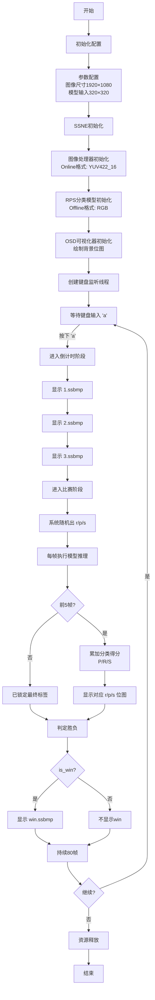

# SSNE AI RPS 分类游戏演示项目

## 项目概述

本项目是基于 SmartSens SSNE (SmartSens Neural Engine) 的 AI 演示程序，实现了一个**石头剪刀布（Rock-Paper-Scissors, RPS）分类互动游戏**。项目使用 C++ 开发，集成了图像处理、AI 模型推理、OSD 可视化显示和键盘交互等功能。

玩家通过摄像头做出石头/剪刀/布的手势，系统通过 AI 模型实时识别手势，并与系统随机出的手势进行胜负判定，最终在 OSD 上显示游戏结果。

## 重要说明

> **图像格式配置注意事项：**
> - **Online（图像采集）格式**: `SSNE_YUV422_16` (YUV422 16位)
> - **Offline（模型输入）格式**: `SSNE_RGB` (RGB三通道)
> - 如果模型输入需要 BGR 格式，请将 offline 的格式修改为 `SSNE_BGR`
>
> **模型输出格式注意事项：**
> - 模型输出为 3 个 float 值，对应 [P, R, S] 三个类别的置信度得分

## 文件结构

```
ssne_ai_demo/
├── demo_rps_game.cpp          # 主演示程序 - RPS分类游戏主循环
├── include/                   # 头文件目录
│   ├── common.hpp             # 公共数据结构定义（IMAGEPROCESSOR、RPS_CLASSIFIER类）
│   ├── utils.hpp              # 工具函数声明、VISUALIZER可视化器类
│   ├── osd-device.hpp         # OSD设备接口定义
│   └── log.hpp                # 日志定义
├── src/                       # 源代码目录
│   ├── rps_classifier.cpp     # RPS分类模型实现（RGB输入，3类输出）
│   ├── pipeline_image.cpp     # 图像处理管道实现（Online配置）
│   ├── utils.cpp              # 工具函数与可视化实现
│   └── osd-device.cpp         # OSD设备接口实现
├── app_assets/               # 应用资源
│   ├── models/
│   │   └── model_rps.m1model  # RPS分类AI模型（320×320输入）
│   ├── background.ssbmp       # 背景位图
│   ├── ready.ssbmp            # 准备阶段位图
│   ├── 1.ssbmp / 2.ssbmp / 3.ssbmp  # 倒计时数字位图
│   ├── r.ssbmp / p.ssbmp / s.ssbmp  # 石头剪刀布位图
│   ├── win.ssbmp              # 胜利位图
│   └── shared_colorLUT.sscl   # 颜色查找表
├── cmake_config/            # CMake配置
│   └── Paths.cmake          # 路径配置文件
├── scripts/                 # 脚本文件
│   └── run.sh              # 运行脚本
├── CMakeLists.txt          # CMake构建配置文件
└── README.md              # 项目说明文档
```

## 核心文件说明

### 1. 主程序文件
- **demo_rps_game.cpp**: RPS分类游戏主演示程序
  - 初始化SSNE引擎
  - 配置图像处理器和RPS分类模型
  - 创建键盘监听线程（`a` 开始游戏，`q` 退出）
  - 主循环：游戏状态机（准备 -> 倒计时 -> 比赛）
  - 每帧执行模型推理，收集分类得分
  - 5帧平均锁定最终分类结果，判定胜负
  - OSD 位图绘制（背景、ready、倒计时、r/p/s、win）
  - 资源释放

### 2. 核心类定义
- **common.hpp**: 定义核心数据结构
  - `IMAGEPROCESSOR`: 图像处理器类，负责从传感器获取图像
  - `RPS_CLASSIFIER`: 石头剪刀布分类器类，封装模型加载与推理

- **utils.hpp**: 工具函数与可视化声明
  - `VISUALIZER`: 可视化器类，支持检测框绘制和位图贴图
  - `DrawBitmap()`: 在OSD上绘制位图资源
  - `ClearLayer()`: 清空指定OSD图层

### 3. 实现文件
- **src/rps_classifier.cpp**: RPS分类模型实现
  - 模型初始化和推理（RGB三通道输入）
  - 输入图像预处理：crop + resize 到 320×320
  - 模型输出解析：3个float得分 [P_score, R_score, S_score]
  - 置信度阈值过滤（默认阈值 0.6）
  - 返回分类标签：`P`(布)、`R`(石头)、`S`(剪刀)、`NoTarget`

- **src/pipeline_image.cpp**: 图像处理管道
  - Online图像采集配置（YUV422_16格式）
  - 图像裁剪配置（如需）
  - Pipeline通道管理

- **src/utils.cpp**: 通用工具函数实现
  - 可视化绘制功能（检测框、位图）
  - OSD 图层管理

- **src/osd-device.cpp**: OSD设备接口
  - 屏幕显示控制
  - 图形绘制功能

### 4. 配置文件
- **CMakeLists.txt**: 构建配置文件
  - 定义编译选项和依赖库
  - 指定源文件和头文件路径
  - 链接SSNE相关库

### 5. 资源文件
- **app_assets/models/model_rps.m1model**: RPS分类AI模型
  - 输入尺寸: 320×320
  - 输入格式: RGB三通道
  - 输出: 3个float值，对应 [P, R, S] 置信度

- **app_assets/<>.ssbmp**: OSD位图资源
  - `background.ssbmp`: 游戏背景
  - `ready.ssbmp`: 准备阶段提示
  - `1/2/3.ssbmp`: 倒计时数字
  - `r/p/s.ssbmp`: 系统随机出的手势
  - `win.ssbmp`: 胜利标识

## Demo 流程图



### 流程说明

#### 1. 初始化配置 (`demo_rps_game.cpp`)

- **参数配置**
  - 配置原图尺寸（1920×1080）
  - 配置分类模型输入尺寸（320×320）
  - 配置模型文件路径：`model_rps.m1model`

- **SSNE初始化**
  - 初始化SSNE引擎

- **图像处理器初始化**
  - 初始化图像处理器，配置原始图像尺寸
  - **Online格式**: `SSNE_YUV422_16`

- **RPS分类模型初始化**
  - 初始化 `RPS_CLASSIFIER` 分类器
  - 加载模型文件，设置预处理管道（crop + resize 到 320×320）
  - **Offline格式**: `SSNE_RGB`

- **OSD可视化器初始化**
  - 初始化可视化器，绘制背景位图（layer 2，一直存在）

- **键盘监听线程**
  - 独立线程监听键盘输入
  - `'a'` / `'A'`：触发游戏开始
  - `'q'` / `'Q'`：退出程序

#### 2. 游戏状态机

##### 阶段一：准备阶段 (`PHASE_READY`)
- 显示 `ready.ssbmp`（layer 3）
- 等待用户按下 `'a'` 键
- 触发后进入倒计时阶段

##### 阶段二：倒计时阶段 (`PHASE_COUNTDOWN`)
- 每 20 帧切换一个数字：1 → 2 → 3
- 使用 `1.ssbmp`、`2.ssbmp`、`3.ssbmp`
- 共 60 帧（约 2 秒）后进入比赛阶段

##### 阶段三：比赛阶段 (`PHASE_BATTLE`)
- 系统随机出 `r/p/s`，显示对应位图
- **前 5 帧**：每帧执行模型推理，累加 [P, R, S] 三个类别的得分
- **第 5 帧**：计算 5 帧平均得分，确定 `final_label`
  - 最大得分 > 0.6：标签为 `P` / `R` / `S`
  - 否则：`NoTarget`
- **胜负判定**：
  - `P` 胜 `R`（布包石头）
  - `R` 胜 `S`（石头砸剪刀）
  - `S` 胜 `P`（剪刀剪布）
- **绘制逻辑保护**：
  - 只在 `final_label` 确定后（frame_counter >= 4）才绘制胜负图，避免闪烁/跳变
  - 只有 `is_win == true` 时才绘制 `win.ssbmp`，输了不绘图
- 持续 80 帧后自动回到准备阶段，清理 layer 3/4

#### 3. 资源释放 (`demo_rps_game.cpp`)

- 释放分类器资源
- 释放图像处理器资源
- 释放可视化器资源
- SSNE引擎释放

## 数据流说明

### 1. 在线处理（Online Processing）- IMAGEPROCESSOR

在线处理负责从传感器获取原始图像：

```cpp
// 初始化
format_online = SSNE_YUV422_16;
OpenOnlinePipeline(kPipeline0);

// 获取图像
GetImageData(img_sensor, kPipeline0, kSensor0, 0);
```

### 2. 离线处理（Offline Processing）- RPS_CLASSIFIER

离线处理负责模型输入准备和推理：

```cpp
// 初始化
inputs[0] = create_tensor(320, 320, SSNE_RGB, SSNE_BUF_AI);
SetCrop(pipe_offline, 210, 270, 750, 810);  // crop 到感兴趣区域
SetNormalize(pipe_offline, model_id);

// 推理
RunAiPreprocessPipe(pipe_offline, *img, inputs[0]);  // crop + resize + 归一化
ssne_inference(model_id, 1, inputs);
ssne_getoutput(model_id, 1, outputs);

// 输出解析
float* data = (float*)get_data(outputs[0]);
// data[0] = P_score, data[1] = R_score, data[2] = S_score
```

### 3. 游戏数据流

1. **图像采集**：从传感器获取 1920×1080 图像（YUV422_16）
2. **预处理**：crop 到 560×540 区域，resize 到 320×320，转 RGB
3. **AI推理**：NPU 执行分类推理，获取 3 类置信度
4. **结果锁定**：前 5 帧平均得分，确定最终手势标签
5. **胜负判定**：与用户手势比对，确定胜负
6. **OSD显示**：在比赛阶段显示系统手势和胜利标识

## 技术特点

1. **AI模型**: RPS 三分类模型，支持石头/剪刀/布手势识别
2. **三通道输入**: RGB 三通道图像输入
3. **图像格式**:
   - Online: YUV422_16
   - Offline: RGB（可根据模型需要修改为BGR）
4. **分类稳定化**: 5帧平均得分策略，避免单帧抖动
5. **图像处理**: 支持图像裁剪、缩放和格式转换
6. **可视化**: OSD 位图贴图显示游戏画面元素
7. **交互设计**: 键盘触发游戏，多线程安全处理
8. **性能优化**: 使用SSNE硬件加速AI推理

## 使用说明

项目通过CMake构建，支持交叉编译到目标嵌入式平台。

### 按键说明

| 按键 | 功能 |
|------|------|
| `a` / `A` | 开始游戏（仅在准备阶段有效） |
| `q` / `Q` | 退出程序 |

### 重要配置项

| 配置项 | 值 | 说明 |
|-------|-----|------|
| 原图尺寸 | 1920×1080 | 根据实际镜头修改 |
| 模型输入 | 320×320 | RPS分类模型输入尺寸 |
| Online格式 | SSNE_YUV422_16 | 图像采集格式 |
| Offline格式 | SSNE_RGB | 模型输入格式（可改为BGR）|
| 置信度阈值 | 0.6 | 低于此值判定为 NoTarget |
| 倒计时帧数 | 60帧 | 每数字20帧 |
| 比赛阶段帧数 | 80帧 | 显示结果后自动回到准备阶段 |
| 平均帧数 | 5帧 | 锁定最终分类结果 |

演示程序启动后显示背景图和 ready 提示，按下 `a` 开始游戏，倒计时结束后进入比赛阶段，系统将随机出手势并与玩家识别的手势判定胜负。
